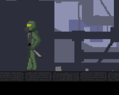
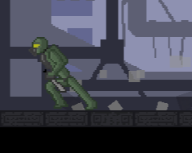
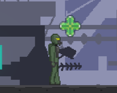
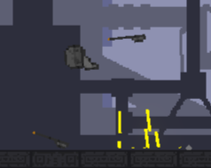
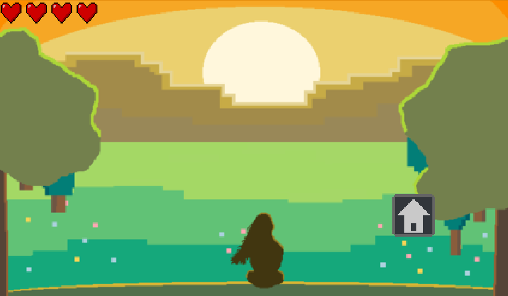

# Unity Game Development Summary

| Field | Detail |
|---|---|
| **Game Title** |Greenfall |
| **Student Name(s)** | ConnorK|
| **Class / Course** |Year 10 Computer Technology |
| **Repository** | https://github.com/TempeHS/2026CT_GameDesign_Greenfall_Connor.K |
| **Unity Version** | 6000.0.58f1 |
| **Document Version** | 0.08 |
| **Date** | 27/08/26|

---

## Table of Contents
1. [Game Overview](#1-game-overview)
2. [Video Walkthrough](#2-video-walkthrough)
3. [Game Mechanics](#3-game-mechanics)
4. [Visual Features](#4-visual-features)
5. [Audio Design](#5-audio-design)
6. [User Interface & HUD](#6-user-interface--hud)
7. [Scene & Level Design](#7-scene--level-design)
8. [Scripts & Programming](#8-scripts--programming)
9. [Development Techniques & Tutorials Acknowledged](#9-development-techniques--tutorials-acknowledged)
10. [Third-Party Content Acknowledgements](#10-third-party-content-acknowledgements)
11. [Challenges & Solutions](#11-challenges--solutions)
12. [Branch Development Summary](#12-branch-development-summary)

---

## 1. Game Overview

### 1.1 Genre
Greenfall is a sidescrolling Action Platformer

### 1.2 Target Audience
Greenfall is targeted towards 12-30 year olds who enjoy action platformers, and might not fully understand the impacts of industrialisation on the Earth

### 1.3 Game Summary
Greenfall is a 2d side-scrolling platformer about a character who tries to escape an industrialised wasteland into nature, and has to make their way through obstacles such as enemies and hazards to get through

### 1.4 Win / Loss Conditions
| Condition | Description |
|---|---|
| Win |Escape the industrialised areas into nature |
| Loss |Die and respawn at a checkpoint |

### 1.5 Platform & Build Settings
| Setting | Detail |
|---|---|
| Target Platform | Windows |
| Resolution | 1920*1080 |
| Build Type | Development |

---

## 2. Video Walkthrough

### 2.1 Full Gameplay Walkthrough

<!--
  Embed a YouTube/Vimeo video or link to a file in the repository.
  YouTube embed syntax:
  

  OR link to a local file:
  [Watch Walkthrough Video](./docs/video/walkthrough.mp4)
-->
[Watch Walkthrough Video](./docs/video/Greenfall2MinVideo.mp4)

| Field | Detail |
|---|---|
| **Video Title** | |
| **Link / Embed** | |
| **Duration** | |
| **Description** | |

### 2.2 Feature Highlight Clips

| Clip | Description | Link |
|---|---|---|
| | | |
| | | |
| | | |

---

## 3. Game Mechanics

### 3.1 Core Mechanics
| ID | Mechanic | Description | Implemented In (Script/Object) |
|---|---|---|---|
| M-1 | Pause Game | Pauses the game and opens a pause menu with some settings | PlayerMovement |
| M-2 | Checkpoint | allows the player to respawn at a set location | |
| M-3 | Health| Allows the player to receive and deal damage | |
| M-4 | Interacting | Allows the player to use core features of the game such as signs, pickups and checkpoints | |
| M-5 | Item Pickups | the player can hold one item and use it whenever they want | |

### 3.2 Player Controls
| Action | Input (Keyboard / Controller) | Description |
|---|---|---|
| Horizontal Movement | A/D | Allows the player to move sideways |
| Jump | Space | Allows the player to jump |
| Dash | LShift | Player rapidly moves in a horizontal direction, ignoring gravity |
| Attack | Mouse Left Click | Allows player to hit and destroy enemies |
| Interact | E | Allows the player to interact with checkpoints and text signs |
| Use | Q | Uses the player's held item |
| Fall | S | The player falls through one way platforms |

### 3.3 Physics & Collision
| Feature | Description |
|---|---|
| One Way Platform | The player can jump on these platforms through the bottom, but cannot fall through the top unless the S key is pressed |
| Spikes | Knocks the player back on contact |
| Enemy Attack | The player is knoced away when they are hit |

### 3.4 Game Loop
| Stage | Description |
|---|---|
| Start / Initialisation | The player spawns in at the start of the game |
| Core Loop | defeat enemies and go past obstacles to reach further right |
| Win / End State | The player reaches the right-most edge of the map |
| Restart | The game takes you to the main menu, where you can start the game over again |

### 3.5 Scoring & Progression
| Element | Description |
|---|---|
| Scoring System | The player gains better stats while they progress |
| Difficulty Progression | the level has more obstacles and enemies do more damage |
| Unlockables / Levels | yeah |

---

## 4. Visual Features

### 4.1 Particle Effects

| Effect Name | Purpose | Screenshot |
|---|---|---|
| Player Walk Particle | To make the player walk feel more physical | |
| Player Dash Particle | emphasise the speed of the dash | |
| Item Use Particle | shows that the item is used and what item | |
| Enemy Gore | when the enemy dies, it leaves parts on the ground | |
| Enemy Death Sparks | The enemy is a robot so it explodes into electricity(in the same screenshot) |  |

> Add screenshot images using: ``

---

### 4.2 Cut Scenes & Cinematics

| Cut Scene | Trigger | Description | Screenshot / Still |
|---|---|---|---|
| Game Endng | WinBox | The player is transported to a green forest with a new parallax and then the final scene is faded in along with the home button | |

> Add screenshot images using: ``

---

### 4.3 Animations

| Animation | Object / Character | Description | Screenshot |
|---|---|---|---|
| Player walk |  |  | |
| Player Attack | | | |
| Player Dash | | | |
| Player Jump | | | |
| Enemy walk | | | |
| Enemy Dash | | | |
| Swaying Grass | | | |
| Front Background Parallax | | | |

> Add screenshot images using: ``

---

### 4.4 Lighting & Post-Processing

| Feature | Description | Screenshot |
|---|---|---|
| Bullet Glow | Gives the cannon projectile a glowing effect | |
| | | |
| | | |

> Add screenshot images using: ``

---

### 4.5 Shaders & Materials

| Shader / Material | Applied To | Description | Screenshot |
|---|---|---|---|
| NoFriction| PlayerBody, PlayerOneWayCollider | Makes it so that there is no friction against the walls so the player does not stick| |
| | | | |
| | | | |

> Add screenshot images using: ``

---

### 4.6 Additional Visual Screenshots

<!--
  Add any other notable screenshots here.
  Syntax: 
-->

| Description | Screenshot |
|---|---|
| | |
| | |
| | |

---

## 5. Audio Design

### 5.1 Music
| Track | Scene / Trigger | Source / Composer |
|---|---|---|
| Multimedia - Greenfall OST | Main Game Scene| Tristan |
| Main Menu Music - House | Main Menu Scene | Yu Lou |

### 5.2 Sound Effects
| Sound Effect | Trigger | Source |
|---|---|---|
| Player Attack | | |
| Player Heal | | |
| Player Hit | | |
| Player Death Jingle | | |

### 5.3 Audio Implementation
| Feature | Description |
|---|---|
| Audio Mixer / Groups | |
| Spatial / 3D Audio | |
| Dynamic Audio | |

---

## 6. User Interface & HUD

### 6.1 HUD Elements
| Element | Purpose | Screenshot |
|---|---|---|
| Player Health | | |
| Player Dash Bar | | |
| Player Held Item | | |

> Add screenshot images using: ``

### 6.2 Menus
| Menu | Purpose | Screenshot |
|---|---|---|
| Main Menu | | |
| Pause Menu | | |
| Game Over Screen | | |
|  | | |

> Add screenshot images using: ``

---

## 7. Scene & Level Design

### 7.1 Scene List
| Scene Name | Purpose | Description |
|---|---|---|
|Main Menu | | |
| Game Scene | | |

### 7.2 Level / Environment Screenshots
| Level / Area | Description | Screenshot |
|---|---|---|
| | | |
| | | |
| | | |

> Add screenshot images using: ``

### 7.3 Scene Management
| Feature | Description |
|---|---|
| Scene Loading Method | |
| Persistent Data Between Scenes | There is no persistent data between scenes as the game is meant to be played in one sitting |
| Scene Transition Effects | |

---

## 8. Scripts & Programming

### 8.1 Script Summary
| Script Name | Attached To | Responsibility |
|---|---|---|
| | | |
| | | |
| | | |
| | | |
| | | |

### 8.2 Key Algorithms / Logic
| Feature | Script | Description |
|---|---|---|
| IInteractable | | |
| | | |
| | | |

### 8.3 Design Patterns Used
| Pattern | Where Applied | Justification |
|---|---|---|
| | | |
| | | |
| | | |

---

## 9. Development Techniques & Tutorials Acknowledged

> List every tutorial, course, video, or article that informed or guided your implementation. Include what you used it for and what you changed or adapted.

| # | Title | Author / Creator | URL / Source | What You Used It For | What You Changed / Adapted |
|---|---|---|---|---|---|
| 1 | | | | | |
| 2 | | | | | |
| 3 | | | | | |
| 4 | | | | | |
| 5 | | | | | |
| 6 | | | | | |
| 7 | | | | | |
| 8 | | | | | |

---

## 10. Third-Party Content Acknowledgements

> All third-party assets (art, audio, fonts, scripts, packages) must be listed here with their licence. Using an asset without acknowledgement may constitute academic misconduct.

### 10.1 Visual Assets
| Asset Name | Type | Creator / Source | Licence | URL | Used For |
|---|---|---|---|---|---|
| | | | | | |
| | | | | | |
| | | | | | |

### 10.2 Audio Assets
| Asset Name | Type | Creator / Source | Licence | URL | Used For |
|---|---|---|---|---|---|
| null| .mp3 | Yu Lou | none provided | none provided | Main Menu Music |
| bleep028| .ogg | dmochas |  Creative Commons Attribution 4.0 International License  | https://dmochas-assets.itch.io/dmochas-bleeps-pack | Sign Interactable Sounds |
| Multimedia - Greenfall OST |.wav| Tristan | none provided | none provided | Main Level Soundtrack|

### 10.3 Scripts & Code Snippets
| Script / Snippet | Source | Licence | URL | Used For | Changes Made |
|---|---|---|---|---|---|
| | | | | | |
| | | | | | |

### 10.4 Unity Packages & Plugins
No External Packages or plugins were used in the creation of Greenfall
| Package Name | Version | Source | Licence | URL | Purpose |
|---|---|---|---|---|---|
| | | | | | |
| | | | | | |
| | | | | | |

### 10.5 Fonts
| Font Name | Creator / Source | Licence | URL |
|---|---|---|---|
| | | | |
| | | | |

---

## 11. Challenges & Solutions

| # | Challenge Encountered | How It Was Solved |
|---|---|---|
| 1 | | |
| 2 | | |
| 3 | | |
| 4 | | |
| 5 | | |

---

## 12. Branch Development Summary

> One section per feature branch. Add or remove sections to match your repository. Branches should be named for the feature they implement e.g. `feature/player-movement`. Link each branch name directly to the branch in your GitHub repository.

---

### Branch 1 — `main`

| Field | Detail |
|---|---|
| **Branch Name** | `main` |
| **Purpose** | Stable, releasable version of the game |
| **Merged From** | |
| **Final Commit** | |

---

### Branch 2 — `feature/`

| Field | Detail |
|---|---|
| **Branch Name** | |
| **Feature Developed** | |
| **Merged Into** | |
| **Date Started** | |
| **Date Merged** | |

#### What Was Built
<!-- Describe what this branch added or changed -->

#### Key Commits
| Commit Message | What Changed |
|---|---|
| | |
| | |
| | |

#### Problems Encountered & Resolved
| Problem | Resolution |
|---|---|
| | |
| | |

#### Screenshot / Evidence
<!-- Add a screenshot of the feature working -->
> ``

---

### Branch 3 — `feature/`

| Field | Detail |
|---|---|
| **Branch Name** | |
| **Feature Developed** | |
| **Merged Into** | |
| **Date Started** | |
| **Date Merged** | |

#### What Was Built

#### Key Commits
| Commit Message | What Changed |
|---|---|
| | |
| | |
| | |

#### Problems Encountered & Resolved
| Problem | Resolution |
|---|---|
| | |
| | |

#### Screenshot / Evidence
> ``

---

### Branch 4 — `feature/`

| Field | Detail |
|---|---|
| **Branch Name** | |
| **Feature Developed** | |
| **Merged Into** | |
| **Date Started** | |
| **Date Merged** | |

#### What Was Built

#### Key Commits
| Commit Message | What Changed |
|---|---|
| | |
| | |
| | |

#### Problems Encountered & Resolved
| Problem | Resolution |
|---|---|
| | |
| | |

#### Screenshot / Evidence
> ``

---

### Branch 5 — `feature/`

| Field | Detail |
|---|---|
| **Branch Name** | |
| **Feature Developed** | |
| **Merged Into** | |
| **Date Started** | |
| **Date Merged** | |

#### What Was Built

#### Key Commits
| Commit Message | What Changed |
|---|---|
| | |
| | |
| | |

#### Problems Encountered & Resolved
| Problem | Resolution |
|---|---|
| | |
| | |

#### Screenshot / Evidence
> ``

---

### Branch 6 — `feature/`

| Field | Detail |
|---|---|
| **Branch Name** | |
| **Feature Developed** | |
| **Merged Into** | |
| **Date Started** | |
| **Date Merged** | |

#### What Was Built

#### Key Commits
| Commit Message | What Changed |
|---|---|
| | |
| | |
| | |

#### Problems Encountered & Resolved
| Problem | Resolution |
|---|---|
| | |
| | |

#### Screenshot / Evidence
> ``

---

### Branch Development Overview

> Complete this summary table once all branches are finished.

| Branch Name | Feature | Date Started | Date Merged | Status |
|---|---|---|---|---|
| `main` | Stable release | | | |
| `feature/` | | | | |
| `feature/` | | | | |
| `feature/` | | | | |
| `feature/` | | | | |
| `feature/` | | | | |

---

> **Student Declaration:** All work submitted is my own except where explicitly acknowledged above.
